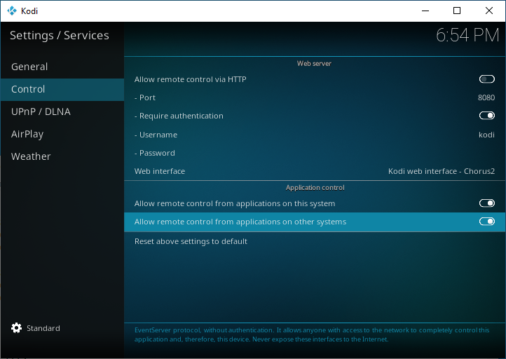

# ESP8266 Kodi EventClient
A simple EventClient for remote controlling Kodi from the ESP8266

## Example

```cpp
#include <KodiEventClient.h>

KodiEventClient kodiClient("192.168.0.4", 9777);
/* ... */
kodiClient.sendButton("play_pause");
kodiClient.sendAction("ShutDown()");
```

Check [List of keynames | Kodi.wiki](https://kodi.wiki/view/List_of_keynames "List of keynames | Kodi.wiki") for other keynames.
Check [Action IDs | Kodi.wiki](https://kodi.wiki/view/Action_IDs "Action IDs | Kodi.wiki") for other actions.

## Kodi settings

Enable: **Allow remote control from application on other systems**:


## Other client implementations
* https://github.com/xbmc/xbmc/tree/master/tools/EventClients
